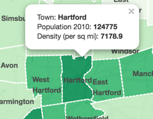
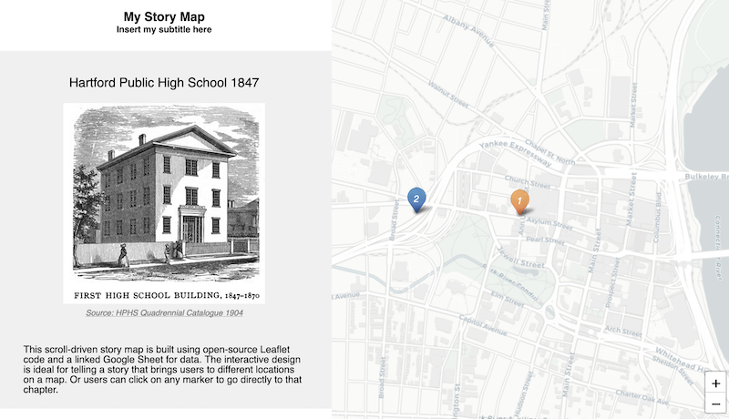
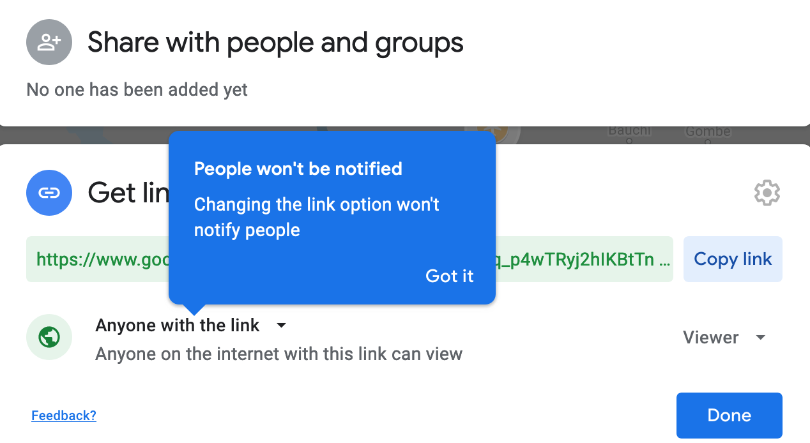

# Map Your Data {#map}

TODO: Rewrite chapter

Maps entice readers to explore your data story and develop a stronger sense of place. But good maps require careful thought about how to clearly communicate spatial concepts with your audience. This book features free tools to create interactive maps that you can embed in your website. In this chapter, you will learn how to:

- Practice key [principles of map design](map-design.html).
- Choose a map type that matches your data story and format, with tutorial links in the table below.
Beginners may start with easy-to-learn tools such as [Google My Maps](mymaps.html), then move up to more powerful tools, such as [Leaflet](leaflet.html), which require you to [Edit and Host Code with GitHub](github.html) or other web servers.  

See also related chapters in this book:

- [Draw and write your data story](draw.html) to capture your ideas on paper
- [Strengthen spreadsheet skills](spreadsheet.html), [Find and know your data](find.html), and [Clean your data](clean.html)
- [Transform your map data](transform.html)
- [Embed your interactive chart on your website](embed.html)
- [Detect bias in data stories](detect.html), including [How to lie with maps](how-to-lie-with-maps.html)
- [Tell your data story](story.html), including its most meaningful insights and limitations

| Basic map types | Best use and tutorial chapters |
| --- | --- |
| Point map        <br>  | Best to show specific locations, such as addresses with geocoded coordinates, with colors for different categories. <br>Easy tool: [Google My Maps tutorial](mymaps.html)<br>Power tool: [Leaflet Maps with Google Sheets](leaflet-maps-with-google-sheets.html) and other [Leaflet templates](leaflet.html) |
| Polygon map      <br>  | Best to show regions (such as nations or neighborhoods), with colors or shading to represent data values. Also known as choropleth map. <br>Easy tool: n/a <br>Power tools: [Tableau Public](tableau-polygon.html) or [Leaflet Maps with Google Sheets](leaflet-maps-with-google-sheets.html) and other [Leaflet templates](leaflet.html) |
| Polyline map     <br>  | Best to show routes (such as trails or transit), with colors for different categories. <br>Easy tool: n/a <br>Power tool: [Leaflet Maps with Google Sheets](leaflet-maps-with-google-sheets.html) and other [Leaflet templates](leaflet.html)|
| Combination map   <br>  | Best to show any combination of points, polygons, or polylines. <br>Easy tool: n/a <br>Power tool: [Leaflet Maps with Google Sheets](leaflet-maps-with-google-sheets.html) and other [Leaflet templates](leaflet.html)  |
| Storymap <br>  | Best for guided point-by-point journey through a historical narrative, with optional photos, audio, or video on an interactive map. <br> Easy tool: [Knight Lab's StoryMap](https://storymap.knightlab.com/), [ESRI Story Maps](https://storymaps.arcgis.com/en/) <br> Power tool: [Leaflet Storymaps with Google Sheets](leaflet-storymaps-with-google-sheets.html) |

TODO:

- heat map
- tab-view map for historical change
- synchronized side-by-side map

## Map Design Principles {- #map-design}

Ask Before You Map: Before you leap into a mapping project, consider these questions:

**Does your data contain geographic information?** Common examples:

- Specific locations or addresses (examples: *Trinity College*, or *300 Summit St, Hartford, CT*)
- Latitude and longitude coordinates (example: *41.756, -72.675*)
- Regions that are legally recognized (such as nations, states, counties, census tracts) or that correspond to a boundary map in your possession (such as designated neighborhoods or health districts)

While there are many more types of geographic information, these examples above are the most common. If your data lacks geographic information, or if you do not possess the corresponding boundary information, it may not be possible to map it.

**Does location really matter to your data story?**

Sometimes a well-designed chart, rather than a map, may be the best way to visualize your data story. Consider these alternatives:

- to show change over time across different locations, consider a line chart

TODO: if we keep, convert to iframe: https://ourworldindata.org/grapher/projected-population-by-country

- to show the relationship between two or more datasets across different locations, consider an XY scatter chart or bubble chart

TODO: TODO: if we keep, convert to iframe: https://ourworldindata.org/grapher/learning-outcomes-vs-gdp-per-capita


If a map is the best way to tell your data story, then choose an appropriate type. See [table of basic map types](map) in this book.

#### Map Design Principles {-}

1. Understand basic map vocabulary: title, legend, baselayer, marker, popup, tooltip, zoom level, polygon, polyline, source.

2. Add source credits and bylines---with links to view data tables and details---to build credibility and accountability.

3. Choose colors wisely.
    - Use color to logically organize your data. Avoid random colors (Wong pp. 40, 44).
    - Avoid bad combinations from opposite sides of color wheel, such as red/green or yellow/blue (Wong pp. 40, 44).
    - Use contrast (such as color vs gray) to call attention to your data story (Knaflic pp. 87-88)

4. Choose basemaps wisely. Basemaps themselves may contain a lot of information, such as terrain, roads, parks, town names, buildings, etc. They may also use colors that can be distracting to the viewer. Think about the minimum number of elements required in the basemap to tell your story.


#### Design polygon maps with ColorBrewer {-}
One of the most useful tools for creating meaningful polygon (or choropleth) maps is ColorBrewer <http://colorbrewer2.org> created by Cynthia Brewer, Mark Harrower and the Pennsylvania State University.


1) Think about the **number of data classes** (or "dividers" or "buckets"). More does not necessarily mean better. Try different numbers and color schemes, and decide if you (and your audience) can easily distinguish between them.
    - A smaller number sorts your data into fewer buckets, and shows a more **coarse map**, but differences in colored ranges become **more visible**.
    - A larger number sorts your data into more buckets, and shows a more **granular map**, but differences in colored ranges become **less visible**.


2) Think about the **nature of data** you are going to display.

- Sequential: best to show steps from lower values (light color) to higher values (dark color)
    - Example: a scale that increases from 1 to 100
- Diverging: best to show extremes (dark colors) around a neutral middle (light color)
    - Example: a scale that highlights extremes from -100 to 0 to 100
- Qualitative: best to show different categories, represented by their own color
    - Example: a map legend of the dominant crop in each area: apples, oranges, bananas


3) Pick a **color scheme**, with options for colorblind-safe and print-friendly.
    - Think about the ideal format for your audiences. Are readers more likely to view your visualization on a computer screen, or in print, or both?

4) Click the Export tab to view all options. Some Leaflet map templates in this book use specific color names (such as "red" or "darkgreen") and some use hexadecimal codes, abbreviated as "hex codes" (such as #ff0000 or #336600). To learn more, use a Color Picker tool, such as <https://www.w3schools.com/colors/colors_picker.asp>

Beware that polygon map design choices about data classes and colors reflect the biases of the author and the software. Read the [Detect Bias in Data Stories](detect.html) chapter in this book, especially [How to Lie with Maps](detect.html#how-to-lie-with-maps)

Learn more:
- Axis Maps, "The Basics of Data Classification," 2010, http://axismaps.github.io/thematic-cartography/articles/classification.html
- Lisa Charlotte Rost, “Your Friendly Guide to Colors in Data Visualisation,” Lisa Charlotte Rost, April 22, 2016, https://lisacharlotterost.github.io/2016/04/22/Colors-for-DataVis/.
- Josh Stevens, "Bivariate Choropleth Maps: A How-To Guide," February 18, 2015, http://www.joshuastevens.net/cartography/make-a-bivariate-choropleth-map/.

## Point Map with Google My Maps {- #mymaps}
TODO: add text, check current documentation and features at https://www.google.com/maps/about/mymaps/

Try it:
Explore the interactive point map below, or [view the full-screen version](https://drive.google.com/open?id=1OPrulm2ISYUb990DJOCoYlt_sWc), created with Google My Maps <https://www.google.com/maps/d/>.

TODO: if we keep, convert to iframe: https://www.google.com/maps/d/u/0/embed?mid=1OPrulm2ISYUb990DJOCoYlt_sWc

Tool review:
- Pros
  - Easy-to learn free mapping tool to import and style point, polyline, and polygon layers and basemap layers
  - Share and collaborate through the Google Drive platform
  - Geocoding error warning
- Cons
  - Limited options to customize map markers
  - Cannot easily create colored polygon maps from data values
  - Cannot extract geocoded data to migrate to another tool

See [video](https://youtube.be/ZVIPn8dJeYM)

Let's build a simple point map with sample data, using Google My Maps <https://www.google.com/maps/d/>. Requires signing up for a free Google Drive account.

1) Click this link and Save to download to your computer: [sample-address-data in CSV format](data/sample-address-data.csv). CSV means comma-separated values, a generic spreadsheet format that most tools can easily open. For help with downloading, see this [short video tutorial](https://www.youtube.com/watch?v=-04PQldP9HQ).

2) Open and sign in to Google My Maps https://www.google.com/maps/d/

3) Click the red + symbol to create a new map, which will be saved automatically to your Google Drive folder.


4) In the map layers area, click the blue Import link. Drag-and-drop the CSV address data file into the web interface to import it.


5) Choose columns to position your placements. Select "Address" for this sample data, then Continue.


6) Choose a column to title your markers. Select "Description" for this sample data, then Finish.


7) After My Maps uploads and geocodes your sample data, click Open Data Table to inspect the results.


8) To style the map markers, click Individual Styles. In this sample data, you can select Group Places By > Style By > Group. This will color markers according to the three categories.


```r
if(knitr::is_html_output()) knitr::include_url("images/06-map/mymaps-style-groups-640w.gif") else knitr::include_graphics("images/placeholder.jpg")
```

<!-- --> 

9) To publish your map on the web, click Share, add a map title, change from Private to Public on the Web, so that anyone can view your map. Click Save and Done.



10) To embed the map on your own website, click the three vertical dots next to the map title for more options, and select Embed On My Site. The tool will generate an iframe code for you to copy. For next steps, go to the [Embed on Your Web](embed.html) chapters in this book.


Learn more:
- Google My Maps Help Page <https://support.google.com/mymaps/answer/3024396>

## Point Map with Carto Builder {- #carto}
TODO:

- Test this tool and decide if it still warrants inclusion in this book
- See note about old versus newer Cartobuilder -- still relevant?
- if this tool stays in the book, check the iframe below to see if update is needed

Try it:
Explore the interactive point map below, or [view the full-screen version](https://jackdougherty.carto.com/builder/1abbb430-ec89-11e6-a661-0e05a8b3e3d7/embed) ,created with Carto Builder <https://carto.com>.

TODO: if we keep, convert to code-chunk iframe: https://jackdougherty.carto.com/builder/1abbb430-ec89-11e6-a661-0e05a8b3e3d7/embed


Tool review:
- Pros:
  - Free and powerful drag-and-drop map tool in the browser
  - Customize point markers and polygon colors by data values
  - Additional features include geographic analysis tools
- Cons:
  - Several steps required to create simple point or polygon map
  - New users may get lost when moving through multiple screens
  - Free account allows only 400 geocodes per month

See [video](https://youtube.be/lto7Z5wC2hQ)

***Before you begin:*** This tutorial uses the newer Carto Builder, rather than older Carto Editor tool. Learn more at <https://carto.com/learn/guides/intro/migrating-from-carto-editor-to-carto-builder>. If you have an old Carto account that has not automatically updated to the new Builder tool, you may need to create a brand-new account to use this tutorial.

Let's build a simple point map with sample data, using Carto Builder <https:/carto.com>. Requires signing up for a free account.

1) Click this link and Save to download to your computer: [sample-address-data in CSV format](data/sample-address-data.csv). CSV means comma-separated-values, a generic spreadsheet format that many tools can easily open.

2) Open Carto in your browser <https://carto.com>.

3) The Carto Dashboard displays two views: Maps and Datasets. Always begin with Datasets, then move to Maps. (Hint: If your dashboard looks very different than mine, then you might still be using the older Carto Editor, rather than the newer Carto Builder.)


4) First, connect your dataset, and soon we'll turn it into a map. Click blue button to add New Dataset.

5) Drag-and-drop the CSV sample address data to upload it, and select Connect Dataset. (Be patient. Sometimes this takes more than 30 seconds.)

6) Inspect your connected dataset.

7) Click the blue Create Map button.

8) Click the Edit Your Map button.

9) In your map data layer, click Add Analysis.

10) In the next screen of Analysis options, select Georeference, then click the Add Analysis button.

11) Back in your map data layer, under Georeference options, select Type > Street Addresses (scroll down to the bottom) for this sample data.

12) Under Parameters, for Column Street Address (abbreviated as Col. Street Ad.), select the "address" field for this sample data. Press the Apply button.

13) After Carto has attempted to geocode your address data, click Style This Analysis. Or, go to the map data layer and click the Style tab.

14) In Style options, for Aggregation select none (the default).

15) Under Style options:

- select Fill Number to change circle sizes
- enter a larger size, such as 13, to make our sample points more visible
- select Fill Color to change circle color
- switch from Solid (all points are same color) to By Value, and scroll down to Group (at the bottom) to automatically color by categories for this sample data. (Hint: If you don't see Group in the menu, click somewhere else and try it again.)


16) In the Pop-up tab, select a Window Style, then select boxes in Show Items to display.

17) In the Legend tab, click Select a Style to display information, and your color-coded groups from above should automatically appear on your map. (Hint: A legend may automatically appear after styling your markers by color.)

18) Before publishing your map: If you wish to rename it, do it now by selecting the three vertical dots next to the file name, and select Rename.

19) To publish your map on the web: Next to your map file name, click the blue “back” arrow (NOT your browser back button) to return to the data layer. Click the green Public button, and on the next screen, click the blue Publish button.


20) On the next screen, Get The Link generates a weblink to your map, and Embed It generates an iframe code to insert the live map in your website. For next steps, go to the [Embed on Your Web](../../embed) chapters in this book.

21) If you make edits to your map, you must click the blue Update button to republish your map to the web.

Learn more:
- Getting Started with Carto Builder <https://carto.com/learn/guides/intro/getting-started-with-carto-builder>

## Filtered Point Map with Socrata Open Data {- #filtered-point-map-socrata}
TODO: decide whether to keep or not; originally co-authored with Veronica.

Open data repositories recently launched by [the State of Connecticut](http://data.ct.gov) and [the City of Hartford](http://data.hartford.gov) both use [the Socrata platform](http://www.socrata.com), which offer user-friendly ways to view, filter, and export data. Also, the Socrata platform includes built-in support to create interactive charts and maps, and to embed them on your own websites. This tutorial demonstrates these features by creating an interactive point map of selected schools from the Connecticut Education Directory in the state data portal. The final product looks like this:

TODO: CT Schools Map 2015 is currently broken; decide whether to keep, and if so, convert to code-chunk iframe. Original links

https://data.ct.gov/w/qzq5-hbms/wqz6-rhce?cur=xi3jnhM8SI_&from=root

https://data.ct.gov/Education/CT-Schools-Map-2015/qzq5-hbms

One advantage of creating data visualizations directly on an open data platform is that the chart or map is linked to the data repository. For example, if the Socrata platform administrator updates the data table, then a Socrata dataviz based on that data will be automatically updated, too. This may be especially useful for "live" data that is continuously updated by agency administrators, such as fire, crime, and property data repositories.

But there are limitations to creating your chart or map on an open data repository platform. First, if the agency stops using the platform, or changes the structure of the underlying data, your online chart or map may stop functioning. Second, you are usually limited to using data tables and geographic boundaries that already exist on that platform, since importing your own may not be an option.

If these limitations concern you, a simple alternative is to export data from the open repository (which means that any "live" data would become "static" data), and import it into your preferred dataviz tool, such as those described in other chapters of this book. A second, more advanced alternative, is to learn how to pull live data from the repository directly into your dataviz, using an Application Programming Interface (API), which requires coding skills that are beyond the scope of this tutorial. To learn more about the Socrata API: <https://dev.socrata.com/>.

#### Steps to create a filtered point map {-}
Sign up for a free account ID on any Socrata platform, such as <https://data.ct.gov/signup>. One account will work on all Socrata sites.


Select your desired dataset in Socrata. In this tutorial, we will use CT Open Data > Education > [CT Education Directory](https://data.ct.gov/Education/Education-Directory/9k2y-kqxn). The data table must include a location column that includes geocoordinates. If there is address data but no geocoordinates, then post a suggestion to the Socrata site administrator to add a geocoded column.


Filter the data to display only the desired rows. The CT Education Directory lists both district offices and school addresses, but for this map we only wish to display the latter. On the top-right corner of the table, click the Filter tab.


Add a New Filter Condition, which displays only the rows you select. In this tutorial, select “Organization Type” and “is”, then type the exact name from the table, such as “Public Schools.” Be sure to type it correctly or the filter may not work. If you wish to select multiple types, add a new filter condition for each. In this tutorial, we also will filter for other types: Public Charter Schools, CT Technical High Schools, Regional Schools, State Agency Facilities, Endowed and Incorporated Academies Schools, and Regional Education Service Center Schools.


Select the Visualize tab and choose Map, which will display several options. First, under Config for Education Direction, select Point Map as the Plot Style, and choose the Location column to identify the geocoordinates.


Further below in the Visualize > Map options, select the checkbox for Advanced Config for the Education Directory to edit the Flyout Details (similar to a pop-up information window) that displays details when users click on a map point. Select data items you wish to display, such as Title: Name, and additional Flyout Details: Organization Type, Location I, and Website. Further down, select the “w/o labels” checkbox to avoid displaying the column headers in your flyout details.


In Visualize > Map > Base Maps, select your desired background map, such as Google Roadmap.


Add a legend to display once you build the map. In the Advanced Configuration area, select the Legend Configuration checkbox and mark its position. After selecting all of these map options, click Apply. Socrata will generate your map with default point colors. Double-check to make sure your data appear, and that your Visualize settings are correct, before moving to the next step.


Assign point colors and legend labels by returning to the Filter tab, and select Conditional Formatting. Understand the difference between these two features. Previously, we used Filter to display only selected types of data (in this case, school buildings, rather than district administrative offices). Now, we will use Conditional Formatting to assign color codes and labels to our filtered data.


In the Conditional Formatting section, type a name into the Description that you wish to display in the legend. You may type a shorter name than the longer name that appears in the data table, such as “Charter Schools” instead of the longer “Public Charter Schools.” Also, select a color for each Description.


Continue to add Conditional Formatting by defining the data columns. In this example, select “All Conditions Apply,” choose “Organization Type” and “Is”, then type the category exactly as it appears in the data table (such as Public Charter Schools). For this map of schools in the CT Education Directory data table, we added several more types (Regional Schools, CT Technical High Schools, etc.) and also added a second rule to identify Magnet Schools (where Organization Type is Public Schools, and Interdistrict Schools is 1).


After setting all of your Conditional Formatting, press Apply at the bottom of the tab. Double-check that your visualization appears exactly as you wish, then Save As under an appropriate name. Note that your visualization will become **publicly visible** to other users on the Socrata open data platform, though you have the option to remove it via your individual profile view.


Visualizations created in the Socrata platform produce HTML iframe codes, which allows you to embed the dataviz in your own website. Select the Embed tab to view and copy the code. Then go to the [Embed on the Web](embed.html) chapters in this book.


## Polygon Maps and Storyboards with Social Explorer {- #social-explorer-maps}
TODO: decide whether to keep or not, since free license terms changed

The Social Explorer free edition <http://socialexplorer.com> offers one solution to creating colored polygon maps with US Census demographic data. Explore the embedded sample map below.

TODO: decide whether or not to keep, and if yes, convert to iframe: https://www.socialexplorer.com/0889800f4d/embed

#### Advantages {-}
- Quick and easy-to-learn
- Free edition includes basic census data
- Export your static maps into presentation slides
- Share link or embed iframe to your interactive map

#### Limitations {-}
- Maps are limited to the demographic data inside the tool.
- Polygon map boundaries are limited to state, county, census tract. The tool does not display municipal data for cities, towns, etc.
- Full census and historical data requires professional subscription.
- Pro subscription available through several academic libraries, but few public libraries.

#### Quick overview of features {-}

Start at the Social Explorer website <http://socialexplorer.com> and click on Maps. This tutorial demonstrates features available on the free edition.


The default map view shows US population density, based on the American Community Survey (ACS) 5-year estimates. Click the Change Data button to explore other options.


Geographic boundaries automatically change with the zoom level. As you zoom in, the data levels automatically shift from state, to county, to census tract.


Click the Share button to copy the link to your map, or the iframe code to embed it inside your own website.


Create a free account to save your online map views. Click the Tell a Story button, add a series of interactive map views, and show change over time.


TODO: Is this still true? All of the steps above can be done with the free version, but data is limited. Check if an academic library near you has a professional subscription.

## Polygon Map with Tableau Public {- #tableau-polygon}
Tableau Public is freely-available software that contains powerful tools to quickly create interactive polygon maps for common boundaries (such as US States, or World Nations.) If you need to create customized maps for less-common boundaries, see our chapter on [Leaflet Maps with Google Sheets](leaflet-maps-with-google-sheets.html) in this volume.

Important: Tableau Public is designed to publicly display your data, which makes this free tool very appropriate for educators, journalists, non-profit organizations, or other users who wish to openly share their map. If you desire a private tool to restrict your data, Tableau offers other tools that require payment.

See also the Tableau Public support page <https://www.tableau.com/support/public> for additional resources, including video tutorials.

1) Download and install the free Tableau Public tool, available for Mac or Windows, at <https://public.tableau.com/en-us/s/download>. Do not confuse with other Tableau products that require payment. Installation may require up to 5-10 minutes.

2) Click this link and Save to download to your computer: [us-sample-data in CSV format](data/us-sample-data.csv). CSV means comma-separated values, a generic spreadsheet format that most tools can easily open. For help with downloading, see this [short video tutorial](https://www.youtube.com/watch?v=-04PQldP9HQ).

3) Open the us-sample-data.csv file with any spreadsheet tool to view its contents.

4) Launch Tableau Public. In the Connect column of the first screen, click "Text file" to connect to the CSV file you downloaded above. (If you had an Excel file in .xlsx format, you would click that instead.) Navigate to select the us-sample.data.csv file on your computer.

5) At first, Tableau Public does **NOT** recognize the names of US areas, which initially appear simply as "text" values (with the "Abc" symbol). Click and hold down the mouse directly on the "Abc" symbol, and use the drop-down menu to convert to Geographic role > State/Province. A tiny globe symbol will appear to show that Tableau Public now recognizes this column as geographic data, which is essential in order to make a map.


6) Go to the Worksheet view, by clicking on "Sheet 1" in the bottom-left corner. The goal is to build a polygon map, based on the dimensions and variables provided by Tableau Public.

Step A - Drag the "Area" dimension to the middle of the worksheet to create the geographic areas

Step B - In the "Marks" panel, change the drop-down menu from "Automatic" to "Map"

Step C - Drag the "Type" dimension into the "Color" box of the Marks panel to show polygon colors according to type


Optional: Add more items, such as "Abbreviation" dimension to "Label" box to display state abbreviations, or "Area" dimension to "tooltips" to display on mouseover.

7) To display your map online, click "Dashboard" tab in the bottom-left corner.

8) Drag "Sheet 1" (the default name of your map) into your dashboard. Also, drag the map legend from the corner into the lower body of the map (or choose other legend options).

9) To publish your map online, go to File > Save to Tableau Public As...  This will require you to create a free Tableau Public Account.

10) Modify your final online product as desired, and see options to embed elsewhere on the web.
